<div align="center">


# 👋 Hey, I'm Jahir Hossain

### Full-Stack Developer • MERN Stack


<br>


</div>

---

## 🚀 About Me


* 💻 I'm a **B.Tech IT student** and aspiring Full-Stack Developer
* ⚛️ Currently building applications with the **MERN Stack**
* 🌱 Currently improving my **React, Node.js, Express.js and MongoDB** skills
* 🔧 Interested in building **real-world full-stack applications**
* 🔐 Learning **authentication, REST APIs and backend development**
* 🧪 Working with **Postman and API testing**
* 🌐 Learning how to deploy and maintain full-stack applications
* 📫 Email: **[jahirhossain5851843@gmail.com](mailto:jahirhossain5851843@gmail.com)**

<br clear="right"/>

---

# 🧑‍💻 What I'm Currently Working On

## 🚀 Full-Stack MERN Project

I'm currently working on a **full-stack project using the MERN stack**.

### My Current Development Stack

```text
Frontend
   │
   └── React.js
          │
          ▼
      REST API
          │
          ▼
Backend
   │
   ├── Node.js
   └── Express.js
          │
          ▼
      MongoDB
```

### 🔨 Currently Learning & Building

* ⚛️ React.js
* 🟢 Node.js
* 🚂 Express.js
* 🍃 MongoDB
* 🔐 Authentication & Authorization
* 📡 REST APIs
* 🧪 Postman
* 🔄 Frontend–Backend Integration
* 📦 Git & GitHub
* 🚀 Full-Stack Deployment

---

# 🛠️ Tech Stack

### 💻 Programming Languages

<p align="center">


</p>

### ⚛️ Frontend Development

<p align="center">


</p>

### 🟢 Backend Development

<p align="center">


</p>

### 🍃 Databases

<p align="center">


</p>

### 🔧 Tools & Platforms

<p align="center">


</p>

---

# 🔥 Featured Projects

<div align="center">

<a href="https://github.com/whojahir/Digital-Clock">

</a>

  

<a href="https://github.com/whojahir/Calculator">

</a>

  

<a href="https://github.com/whojahir?tab=repositories">

</a>

</div>

---

# 🌐 Full-Stack Development

### MERN Architecture

```text
                    ┌─────────────────┐
                    │    React.js     │
                    │    Frontend     │
                    └────────┬────────┘
                             │
                             │ HTTP / JSON
                             ▼
                    ┌─────────────────┐
                    │   Express.js    │
                    │    REST API     │
                    └────────┬────────┘
                             │
                             ▼
                    ┌─────────────────┐
                    │     Node.js     │
                    │ Backend Runtime │
                    └────────┬────────┘
                             │
                             ▼
                    ┌─────────────────┐
                    │    MongoDB      │
                    │    Database     │
                    └─────────────────┘
```

---

# 📊 GitHub Stats

<div align="center">



</div>

---

# 📈 GitHub Contribution Activity

<div align="center">


</div>

---

# 🔥 GitHub Streak

<div align="center">


</div>

---

# 🏆 GitHub Trophies

<div align="center">


</div>

---

# 🐍 Contribution Snake

<div align="center">


</div>

---

# 📚 Currently Learning

<div align="center">

|     Technology    | Current Focus                        |
| :---------------: | :----------------------------------- |
|    ⚛️ React.js    | Components, Hooks & State Management |
|     🟢 Node.js    | Backend Development                  |
|   🚂 Express.js   | REST API Development                 |
|     🍃 MongoDB    | Database & Data Modeling             |
| 🔐 Authentication | JWT & Authorization                  |
|    📡 REST API    | Frontend–Backend Communication       |
|     🧪 Postman    | API Testing                          |
|  📦 Git & GitHub  | Version Control & Collaboration      |
|   🚀 Deployment   | Full-Stack Applications              |

</div>

---

# 🎯 My Goals

* [ ] Become a confident **MERN Stack Developer**
* [ ] Complete my current **full-stack project**
* [ ] Build more real-world applications
* [ ] Improve backend development skills
* [ ] Learn advanced React
* [ ] Build secure authentication systems
* [ ] Improve database design
* [ ] Deploy production-ready applications
* [ ] Contribute to open-source projects
* [ ] Build projects that solve real problems

---

# 🤝 Connect With Me

<div align="center">

<a href="https://linkedin.com/in/jahir-hossain-62287223a">

</a>

<a href="https://youtube.com/@jahir9329">

</a>

<a href="https://twitter.com/wh0jahir">

</a>

<a href="https://instagram.com/whojahir">

</a>

<a href="https://www.hackerrank.com/whojahir">

</a>

</div>

---

<div align="center">

### 🚀 Building. Learning. Improving.

**Thanks for visiting my profile!**

</div>
